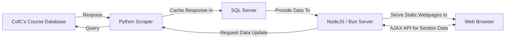
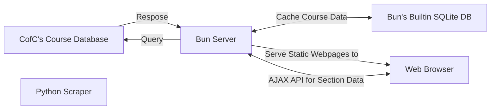
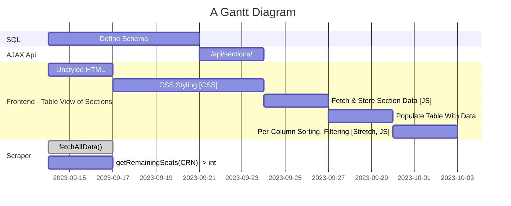

# What are we Building?

## Project Idea 
- assigned to Sierra

baza hint: 

> what is the problem that your system solves? give statistics !!!

## Existing Works 
- assigned to Connor

baza hint: 

> Market Survey/related or existing works. what are the pros and cons of them? How your system will address these limitations? -->

## Stakeholders. 
- assigned to Matt
- Explain the stakeholders with the role(s) of each stakeholder. 
- at least 3-4 stakeholders needed

## Requirements
- assigned to Sierra

### Functional
### Non-Functional

# How are we Building it?

## Proposed System Design

### Option A: Independent Scraper & Web-Server

### Option B: Monolithic

## Process
- Assigned to Connor
- probably agile. 

Baza hint: 

> explain why

## Timeline 
- Assigned to Anabelle
- will probably get group approval for this
- will use mermaid.live to make gannt chart

## Risk Analysis
- Assigned to Matt

I'm not 100% sure if he wants things that would risk non-delivery, or would risk causing harm

## Development Tools
- [Bun](?)
- [Hono]
- [SQLite]
- [Python]
- [jQuery]
- [Pandoc]

## Budget
- Nothing Required
- Domain name
  - classes.anabelle.dev - Free
  - cougarclass.es - $20
  - cougarclasses.org - $8
- Self-Hosting with own computer - Free

## Contingency Plans
- We could probably use Apache if [Bun] becomes unstable

<!--Links-->
[Bun]:             bun.sh
[Hono]:            hono.dev
[SQLite]:          sqlite.org
[Python]:          python.org
[jQuery]:          jquery.com
[Pandoc]:          pandoc.org
