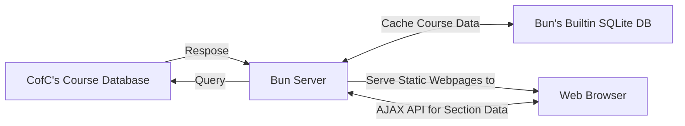

# What are we Building?

## Project Idea

### Problem: 

Current class registration tools:

- Don't show if the classes meet degree requirements
- Don't show crowd-sourced professor feedback
- Currently requrire cross-referencing  websites

### Solution: 
Create a single accessible tool that allows students to plan their next semester

### Benefits: 
- Easier to find courses that satisfy degree requirements
- Help to create a Schedule to fit the needs of the student

## Existing Works
CofC's existing registration system has several pros/cons compared to our proposed system:

#### Pros:
1. You can't sign up for classes that conflict with your schedule.
2. Shows you the fees that the classes will add to your bill.
3. Has direct CRN lookup so you don't have to search for the class you want.

#### Cons:
1. There are no recommendations for what classes to take, you instead must view degree works to see what classes you're missing.
2. No reminders about when to sign up so if you miss your sign-ups you might not get a class you need for graduation.
3. Have to compete with other students to get the classes you need for graduation.

<!-- Our system will address these limitations by being able to filter classes by major and get recommendations for what classes to take based on major these two solutions simplify the registration process for students just looking to complete what they need for their major. The registration assistant will also send the student reminders about when registration starts and the registration assistant will automatically register the student for classes they desire ahead of time which eliminates the chance of missing sign-ups. -->


## Stakeholders

### Customer: College of Charleston.
The purpose of this project is to make it easier for their customers(CofC students) to manage their classes and schedules; CofC directly benefits from any improvement in this process. Will need to ensure their current methods of maintaining their class database do not significantly alter to ensure we can capture and process the data.

### End User: Students
Our project only covers the College of Charleston, and as such the only end users for this project will be students actively enrolled at CofC or those interested in enrolling. As development progresses, potential end-users may be contacted for testing/feedback purposes to improve the end product.

### Dev Team: Our Group
Handled by the project team, with potential outsourcing of beta testing for user feedback.


## Requirements

### Functional
- Students should be able to search for classes by column values and degree requirements
- Students should recieve reminders for when class registration opens
- Students should be able to access additional information on sections

### Non-Functional
- Publication to a domain so that anyone with updated browsers should be able to fully experience the website
- Website should be able to handle 40 simutaneous users
- Website should have WCAG accessible colors


# How are we Building it?


## Proposed System Design


## Process - Why use Agile?

### 1. Early and Continuous Delivery:
Agile prioritizes the delivery of working software early and often,
which helps in identifying issues, gathering feedback,
and making necessary adjustments early in the development process.

### 2. Improved Quality:
Frequent testing and quality assurance activities are integral to Agile.
This results in higher software quality,
as issues are detected and resolved promptly,
reducing the chances of bugs.

### 3. Risk Management:
Agile encourages risk mitigation through regular assessment and adaptation. 
By breaking down the project into smaller,
manageable increments,
it becomes easier to manage risks effectively.

### 4. Customer involvement:
Agile encourages the active involvement of customers and end-users throughout the development process,
ensuring that the product aligns with their expectations and needs.


## Sprint Dates

| Sprint Name                    | Ends on
| ---                            | :----:  
| "8 Sprints Left"                 | 2023-09-24
| "7 Sprints Left"                 | 2023-10-01
| "6 Sprints Left"                 | 2023-10-08
| "5 Sprints Left"                 | 2023-10-15
| "4 Sprints Left"                 | 2023-10-22
| "3 Sprints Left"                 | 2023-10-29
| "2 Sprints Left"                 | 2023-11-05
| Peinultimate Sprint            | 2023-11-12
| Final Sprint                   | 2023-11-19
| ~~Thanksgiving Week~~          | ~~2023-11-26~~
| ~~Final Full Week of Classes~~ | ~~2023-12-03~~

<!--
```mermaid
gantt
    dateFormat  YYYY-MM-DD

    section SQL
    Define Schema - User:               SQLUser, 2023-09-14, 1d
    Define Schema - Section:            SQLSection, 2023-09-14, 1d
    Define Schema - Rate my Professors: SQLRMP, 2023-09-14,1d

    section AJAX Api
    /api/sections/ schema:          APIListSectionSchema, after SQLSection, 3d
    /api/sections/ implementation:  APIListSection, after APIListSectionSchema jsonSQL, 3d
    /api/section schema:            APISingleSectionSchema, after SQLSection, 3d
    /api/section implementation:    APISingleSection, after APISingleSectionSchema jsonSQL, 3d

    section Frontend - Sections Table
    Base HTML:                  tableBaseHTML, 2023-09-14, 3d
    CSS:                        tableCSS, after tableBaseHTML, 7d
    Fetch & Store Section Data: tableFetchAndStore, after tableBaseHTML APIListSectionSchema, 3d
    Populate Table With Data:   tablePopulate, after tableFetchAndStore, 3d
    Sorting:                    tableSorting, after tablePopulate, 1d
    Filtering:                  tableFiltering, after tablePopulate, 1d

    section Frontend - Class Details
    Base HTML:                          sectionHTML, 2023-09-14, 1d
    CSS:                                sectionCSS, after sectionHTML, 1d
    Fetch & Populate Section Data:      sectionFetch, after sectionHTML
    Graph of Remaining Seats over Time: sectionGraph, after sectionHTML

    section Accounts
    /login HTML, CSS:                   authHTML
    Authentication Tokens:              authCookie
    Past Professors - user input HTML: 


    fetchAllData():                done, 2023-09-14, 3d
    getRemainingSeats(CRN) -> int: 2023-09-14, 3d

    section WebScraper
    Rewrite auth code in node.js:    scraperRewriteNode
    JSON <-> SQL Helper Functions:   jsonSQL, after scraperRewriteNode
    

```
-->

## Risk Analysis

### Time Risk:
- Inherent risk of going over allotted development time. To mitigate time issues, the project will be developed using an Agile development model, as covered previously.

### Database Risk:
- We'll mitigate priavcy concerns by storing sensitive user data in the browser instead of on our own servers.

## Risk Analysis, Continued

### Resource Risk:
- Potential risk of delayed development due to lack of tools/equipment. Mitigated by using open-source software and personal equipment, with backup laptops available if needed.

### Functionality Risk:
- Many base functions for registration already exist in MyPortal. Goal of this project is to expand this functionality with additional quality-of-life improvements. Risk involved of implementing redundant or unused functionality. Mitigated by removing unused functionality and introducing requested functionality based on rolling testing, ideally with non-development team testers to provide additional feedback.

## Development Tools
- [Bun]
- [Hono]
- [SQLite]
- [jQuery]
- [Pandoc]

## Budget
- Nothing Required
- Domain name
  - classes.anabelle.dev - Free
  - cougarclass.es - $20
  - cougarclasses.org - $8
- Hosting:
  - Self-Hosting with own computer - Free
  - AWS Free Tier - Free

## Contingency Plans
If we need to switch from [bun] to nodejs:

- We'll use Apache to serve static content
- We'll use SQLITE instead of the builtin SQL server

<!--Links-->
[Bun]:             bun.sh
[Hono]:            hono.dev
[SQLite]:          sqlite.org
[Python]:          python.org
[jQuery]:          jquery.com
[Pandoc]:          pandoc.org
