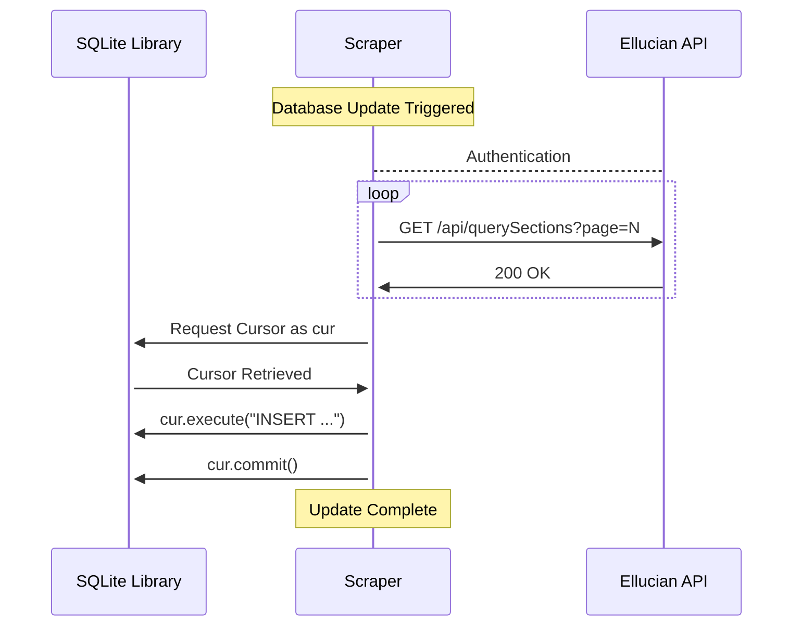
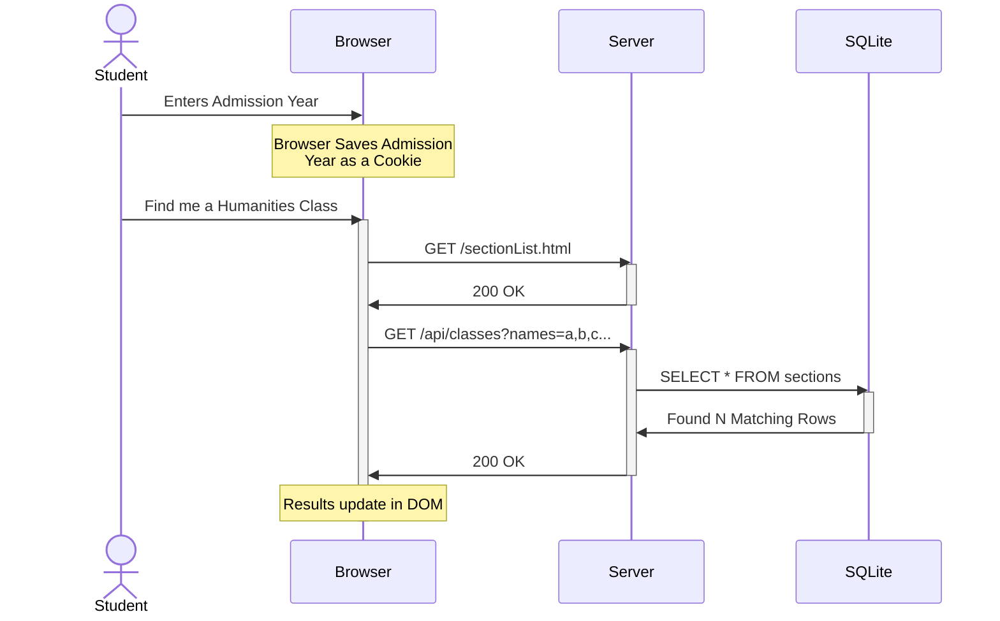

Using The Class List

## Updating the database

```mermaid
sequenceDiagram
    participant DB as SQLite Library
    participant S as Scraper
    participant API as Ellucian API
    note over S: Database Update Triggered
    S --> API: Authentication
    activate S
    loop
        S ->> API: GET /api/querySections?page=N
        API ->> S: 200 OK
    end
    S ->>+ DB: Request Cursor as cur
    DB ->> S: Cursor Retrieved
    S ->> DB: cur.execute("INSERT ...")
    S ->> DB: cur.commit()

    note over S: Update Complete
```

## Searching for a class

```mermaid
sequenceDiagram
    actor Student
    participant Browser
    participant Server
    participant SQLite

    Student ->> Browser: Enters Admission Year
    note over Browser: Browser Saves Admission<br> Year as a Cookie

    Student ->> Browser: Find me a Humanities Class
    activate Browser
    
    Browser ->> Server: GET /sectionList.html
    activate Server
    Server ->> Browser: 200 OK
    deactivate Server
    
    Browser ->> Server: GET /api/classes?names=a,b,c...
    activate Server
    Server ->> SQLite:SELECT * FROM sections
    activate SQLite
    SQLite ->> Server: Found N Matching Rows
    deactivate SQLite
    Server ->> Browser: 200 OK
    deactivate Server
    note over Browser: Results update in DOM
    deactivate Browser
```
