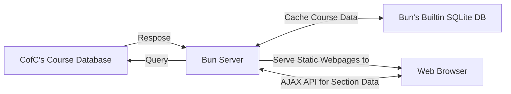
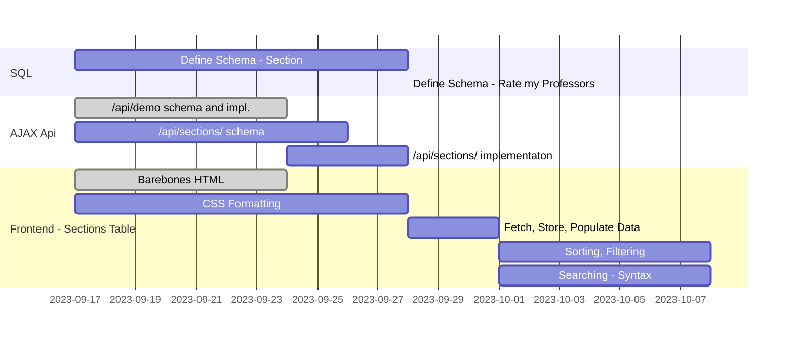

# Project Idea:

## Problem 
Current class registration tools do not show degree requirements next to registration information. If a user wishes to plan a schedule with classes that complete their degree, they must cross reference at least two websites.

## Solution
Create a single accessible tool that allows students to plan their next semester

# Existing Works:
CofC's existing registration system has several pros/cons compared to our proposed system:

- Helps students find courses that satisfy degree requirements
- Improves visibility of infrequently-searched courses that satisfy general education requirements

## Comparison Table

|     | View open sections | View professor ratings | View degree Requirements |
| :---                             |  :---:  |  :---:  |  :---:  |
| Degreeworks                      |    -    |    -    |   Yes   |
|                                  |         |         |         |
| Ellucian Registration Tools      |   Yes   |    -    |    -    |
|                                  |         |         |         |
| Rate My Professors               |    -    |   Yes   |    -    |
|                                  |         |         |         |
| Coursicle                        |   Yes   |   Yes   |    -    |
|                                  |         |         |         |
| **Class Registration Assistant** | **Yes** | **Yes** | **Yes** |

# Stakeholders:

## Current Students
Most of our users should fall into this category. Students are responsible for making decisions about what classes they enroll in, and thus are most likely to use this tool.

## Advisors
Students may wish to share their course-list with their advisors, and vice versa.

## Prospective Students
Prospective students may want to see a list of sections offered by the school. It is unlikely that we can offer much of value to this user, as Coursicle shows classes for hundreds of schools, which is a level of depth that we cannot match with our small team of four. 

## Teachers
Teachers may be upset if negative reviews of their teaching are present on our website. Special care should be taken to ensure that teachers are not made upset by our product.

# Requirements:

## Functional
- Students should be able to search for classes by column values and degree requirements
- Students should receive reminders for when class registration opens (stretch goal)
- Students should be able to access additional information on sections
- Students should be able to 

## Non-Functional
- Publication to a domain so that anyone with updated browsers should be able to fully experience the website
- Website should be able to handle 40 simultaneous users
- Website should have WCAG accessible colors

# System Design:

# Process:
We will use agile for this project for a number of reasons:

### 1. Early and Continuous Delivery:
Agile prioritizes the delivery of working software early and often,
which helps in identifying issues, gathering feedback,
and making necessary adjustments early in the development process.

### 2. Improved Quality:
Frequent testing and quality assurance activities are integral to Agile.
This results in higher software quality,
as issues are detected and resolved promptly,
reducing the chances of bugs.

### 3. Risk Management:
Agile encourages risk mitigation through regular assessment and adaptation. 
By breaking down the project into smaller,
manageable increments,
it becomes easier to manage risks effectively.

### 4. Customer involvement:
Agile encourages the active involvement of customers and end-users throughout the development process,
ensuring that the product aligns with their expectations and needs.

# Timeline:
## Sprint dates

| Sprint Name                    | Ends on
| ---                            | :----:  
| "8 Sprints Left"               | 2023-09-24
| "7 Sprints Left"               | 2023-10-01
| "6 Sprints Left"               | 2023-10-08
| "5 Sprints Left"               | 2023-10-15
| "4 Sprints Left"               | 2023-10-22
| "3 Sprints Left"               | 2023-10-29
| "2 Sprints Left"               | 2023-11-05
| Peinultimate Sprint            | 2023-11-12
| Final Sprint                   | 2023-11-19
| ~~Thanksgiving Week~~          | ~~2023-11-26~~
| ~~Final Full Week of Classes~~ | ~~2023-12-03~~

## Gannt

# Risk Analysis:

We face several risks in the implementation of this project

## Time Risk:
There is an inherent risk of going over our allotted development time. To mitigate these issues, the project will be developed using an Agile development model, as covered previously.

## Privacy Risk:
If we need to collect sensivite user data to assist in scheudling classes, there's a risk that we could compromise user privacy if we get hacked. We can mitigate these concerns by storing sensitive user data in the browser when possible.

## Resource Risk:
There is a potential risk of delayed development due to lack of tools/equipment. this risk is mitigated by using open-source software and personal equipment, with backup laptops available if needed.

## Functionality Risk:
Many base functions for registration already exist in MyPortal. While the goal of this project is to expand beyond this base functionality, we may encounter unforseen technical or practical obstacles that make it infeasable to develop these differentiating features. We can mitigate this risk by

- focusing on creating a [Minimum Lovable Product] instead of achieving feature-for-feature parity with more complex tools
- Make a lean prototype as soon as possible to get feedback [early]{.underline} and [often]{.underline}
- Use user feedback to guide incrimental improvements

[Minimum Lovable Product]: https://productschool.com/blog/product-strategy/minimum-lovable-product

## Development Tools
- For our backend, we are using [Bun]. Bun is a lightweight serverside javascript runtime produced by Oven. It comes with developer-friendly standard libraries for SQLite and password storage, a speedy package manager, and a builtin test suite based off of Jest.

- To build our API, we're using [Hono].
- To store our data, we're using [SQLite]. This allows us to persist section information in a space-efficient file format when restarting the server, and allows us to use bun's builtin Sqlite Libraries.
- We do not plan on using a framework at this time. We may add a framework if we find ourselves reusing similar components, or needing to perform serverside hydration of webpages to mitigate clientside performance concerns.
- To write our documentation, we're using [Pandoc]'s markdown. This allows us to write documentation that
  - Can be tracked and version-controlled in git
  - Can be converted to LaTeX, PDF, PPTX, etc.
- We're using [Mermaid] for our charts. Mermaid lets us embed diagrams (eg: gannt charts, SSDs, flowcharts, timelines, etc.) directly into our markdown files.
  - it lets us version controll our diagrams with git
  - it makes the process of modifying these diagrams easier (we can change the source code instead of futzing about in a visual WYSIWYG editor)
  - it integrates seamlessly with pandoc (with the npm package "mermaid filter") and github (which renders mermaid charts in it's preview of markdown files). 

## Budget
We don't anticipate any mission-critical expenses. However, we may use personal funds to purchase specific resources. One potential item is a domain name. if we choose to aquire a domain name, we'll purchase it for one year for no more than $12. 

Another potential cost is OpenAI tokens - we may use openAI to generate computer-readable JSON objects describing historic academic major requirmeents based off of annual wayback machine snapshots of cofc webpages.

there are hundreds of such documents that need to be encoded in order to ensure accuracy not just for recently-matriculated students, but also for students who declared their major in 2022,21,20,19, etc.

- OpenAI tokens 
- Domain name
  - classes.anabelle.dev - Free
  - cougarclass.es - $20
  - cougarclasses.org - $8
- Hosting:
  - Self-Hosting with own computer - Free
  - AWS Free Tier - Free

## Contingency Plans
If we need to switch from [Bun] to NodeJS:

- We'll use Apache to serve static content
- We'll use SQLITE instead of the builtin SQL server

<!--Links-->
[Bun]:             https://bun.sh
[Hono]:            https://hono.dev
[SQLite]:          https://sqlite.org
[Python]:          https://python.org
[Mermaid]:         https://mermaid.js.org
[Pandoc]:          https://pandoc.org
