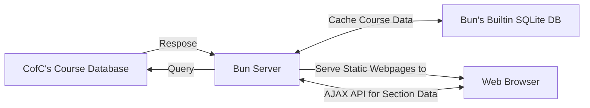

## Project Idea

### Problem: 
Current class registration tools do not show degree requirements next to registration information. If a user wishes to plan a schedule with classes that complete their degree, they must cross reference at least two websites:

### Solution: 
Create a single accessible tool that allows students to plan their next semester

### Comparison to Existing Works 

| | Degreeworks | Ellucian Registration Tools | Rate My Professors | Coursicle | **Class Registration Assistant**
|:----------------------------| :-: | :-: | :-: | :-: |   :-:   |
|    See list of sections     |  -  | Yes |  -  | Yes | **Yes** |
|    See professor ratings    |  -  |  -  | Yes | Yes | **Yes** |
|    See degree Requirements  | Yes |  -  |  -  |  -  | **Yes** |
<!----------------------------| DW  | ERT | RMP | CRS |   CRA   |-->

### Benefits: 
- Helps students find courses that satisfy degree requirements
- Improves visibility of infrequently-searched courses that satisfy gened requirements

## Existing Works
CofC's existing registration system has several pros/cons compared to our proposed system:

## Stakeholders

### Current Students
Most of our users should fall into this category. Students are responsible for making decisions about what classes they enroll in, and thus are most likely to use this tool

### Advisors

### Prospective Students

### Teachers

### Administrators

## Requirements

### Functional
- Students should be able to search for classes by column values and degree requirements
- Students should recieve reminders for when class registration opens
- Students should be able to access additional information on sections

### Non-Functional
- Publication to a domain so that anyone with updated browsers should be able to fully experience the website
- Website should be able to handle 40 simutaneous users
- Website should have WCAG accessible colors


# How are we Building it?


## System Design


## Process - Why use Agile?

### 1. Early and Continuous Delivery:
Agile prioritizes the delivery of working software early and often,
which helps in identifying issues, gathering feedback,
and making necessary adjustments early in the development process.

### 2. Improved Quality:
Frequent testing and quality assurance activities are integral to Agile.
This results in higher software quality,
as issues are detected and resolved promptly,
reducing the chances of bugs.

### 3. Risk Management:
Agile encourages risk mitigation through regular assessment and adaptation. 
By breaking down the project into smaller,
manageable increments,
it becomes easier to manage risks effectively.

### 4. Customer involvement:
Agile encourages the active involvement of customers and end-users throughout the development process,
ensuring that the product aligns with their expectations and needs.


## Project Timeline
### Sprint dates

| Sprint Name                    | Ends on
| ---                            | :----:  
| "8 Sprints Left"                 | 2023-09-24
| "7 Sprints Left"                 | 2023-10-01
| "6 Sprints Left"                 | 2023-10-08
| "5 Sprints Left"                 | 2023-10-15
| "4 Sprints Left"                 | 2023-10-22
| "3 Sprints Left"                 | 2023-10-29
| "2 Sprints Left"                 | 2023-11-05
| Peinultimate Sprint            | 2023-11-12
| Final Sprint                   | 2023-11-19
| ~~Thanksgiving Week~~          | ~~2023-11-26~~
| ~~Final Full Week of Classes~~ | ~~2023-12-03~~

## Gannt
```mermaid
gantt
    dateFormat  YYYY-MM-DD

    section SQL
    Define Schema - Section:            SQLSection, {8SL}
    Define Schema - Rate my Professors: SQLRMP, 

    section AJAX Api
    /api/demo schema and impl.:     APIDemo, {8SL-7SL}
    /api/sections/ schema:          APIListSectionSchema, {8SL} - Tuesday - demo data
    /iapi/sections/ implementaton:  APIListSection, {7SL} - anabelle, connor
    
    section Frontend - Sections Table
    Barebones HTML:             tableBaseHTML {8SL} done
    CSS Formatting:             tableCSS {7SL} - sierra
    Fetch, Store, Populate Data:tableFetchAndStore {7SL} - post thursday - sierra, connor
    Sorting, Filtering:         tableFS {7SL} 
    Searching - Syntax:         tableSearchSchema {7SL}

    section WebScraper
    Basic Download Each Section:    scraperRewriteNode, {7SL} Anabelle, Matt
    Fetch Section Prerequisites:    fetchPrereqs

    section Single Section View
    /api/section schema:                APISingleSectionSchema 
    /api/section implementation:        APISingleSection
    Base HTML:                          sectionHTML
    CSS:                                sectionCSS
    Fetch & Populate Section Data:      sectionFetch
    Graph of Remaining Seats over Time: sectionGraph

    section Accounts
    /login HTML, CSS:                   authHTML
    Authentication Tokens:              authCookie
    Past Professors - user input HTML: 

    section UI/UX
    Draft Prototype:                                UIDraft
    Create Paper Prototype:                         UIPaper
    Test Paper Prototype with Students, Teachers:   UIPaperTest

    section Storing Degree Requirements
    Create schema (json, SQL):                                 ReqCourseSchema
    Manually add 2023 Gen-ED REQs:                             ReqCourseInitial
    Create web form to add degree requirements:                ReqCourseForm
    Use web form to add requirements (all majors, many years): ReqCourseBackfill

    section Interactive Degree Checker
    create form to ask start year, majors:
    
    section Mutli-Year Course Planning
    Create recursive requirements solver:
    Document fall/spring only classes:

    section Share Courselist
    create json represen   
```

## Risk Analysis

### Time Risk:
- Inherent risk of going over allotted development time. To mitigate time issues, the project will be developed using an Agile development model, as covered previously.

### Database Risk:
- We'll mitigate priavcy concerns by storing sensitive user data in the browser instead of on our own servers.

## Risk Analysis, Continued

### Resource Risk:
- Potential risk of delayed development due to lack of tools/equipment. Mitigated by using open-source software and personal equipment, with backup laptops available if needed.

### Functionality Risk:
- Many base functions for registration already exist in MyPortal. Goal of this project is to expand this functionality with additional quality-of-life improvements. Risk involved of implementing redundant or unused functionality. Mitigated by removing unused functionality and introducing requested functionality based on rolling testing, ideally with non-development team testers to provide additional feedback.

## Development Tools
- [Bun]
- [Hono]
- [SQLite]
- [jQuery]
- [Pandoc]

## Budget
- Nothing Required
- Domain name
  - classes.anabelle.dev - Free
  - cougarclass.es - $20
  - cougarclasses.org - $8
- Hosting:
  - Self-Hosting with own computer - Free
  - AWS Free Tier - Free

## Contingency Plans
If we need to switch from [bun] to nodejs:

- We'll use Apache to serve static content
- We'll use SQLITE instead of the builtin SQL server

<!--Links-->
[Bun]:             bun.sh
[Hono]:            hono.dev
[SQLite]:          sqlite.org
[Python]:          python.org
[jQuery]:          jquery.com
[Pandoc]:          pandoc.org
